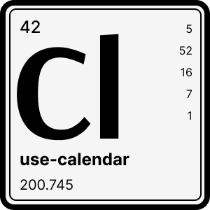

<br />
<div align="center">
  
  <h1 align="center">use-calendar</h3>
  <p align="center">Headless calendar hook for React</p>
  <p align="center">
    
    
  	 <a href="https://codeclimate.com/github/tuplo/use-calendar/test_coverage"></a>
  </p>
</div>

## Why

Other similar solutions were a bit too heavy on dependencies or didn't support all features we needed.

* No dependencies
* WAI-ARIA compliant
* Events	 

## Install

```bash
$ npm install @tuplo/use-calendar

# or with yarn
$ yarn add @tuplo/use-calendar
```

## Usage

Minimal example

```jsx
import { useCalendar } from '@tuplo/use-calendar'

function Calendar() {
  const {
    months,
    getDayProps,
    getBackProps,
    getForwardProps
  } = useCalendar()

  return (
    <>
      {months.map(({ year, month, weeks }) => (
        <div>
          <header>
            <h1>{month} {year}</h1>
          </header>
          <nav>
            <button {...getBackProps()}>Prev</button>
            <button {...getForwardProps()}>Next</button>
          </nav>
          {
            weeks.map((week) =>
              week.map((day) =>
                day
                  ? <button {...getDayProps({ day })}>{day.date.getDate()}</button>
                  : <span />
              )
          }
        </div>
      ))
    </>
  )
}
```

## Options

```typescript
const calendarProps = useCalendar({
  availableDates: [new Date('2022-07-11'), new Date('2022-07-12')],
  events: [{ start: new Date('2022-12-25'), title: 'Christmas' }],
  firstDayOfWeek: 1,
  minDate: new Date('2022-07-01'),
  maxDate: new Date('2022-07-31'),
  monthsToDisplay: 1,
  onDateSelected: (day) => console.log(day.date),
  selectedDate: new Date('2022-07-11'),
});
```

### availableDates

> `Date[]` | optional

Which days should be selectable on the calendar.

### events

> `{ start: Date, end?: Date, [k: string]: unknown }[]` | optional

List of events. The only required attribute on a `Event` is the `start` date. Any custom attributes you send in, will be returned back on the corresponding days, ex: `isAllDay: true`

### firstDayOfWeek

> `number` | defaults to `0`

First day of the week with possible values 0-6 (Sunday to Saturday). Defaults to
Sunday.

### minDate

> `Date` | optional

Used to calculate the minimum month to render.

### maxDate

> `Date` | optional

Used to calculate the maximum month to render.

### monthsToDisplay

> `number` | defaults to `1`

Number of months returned, based off the `selectedDate`. `Infinity` will display all months with available dates.


### onDateSelected

> `function(day: Day)` | optional

Called when the user selects a date.

### selectedDate

> `Date | string | number` | optional

Used to calculate what month to display on initial render.

## License

MIT
